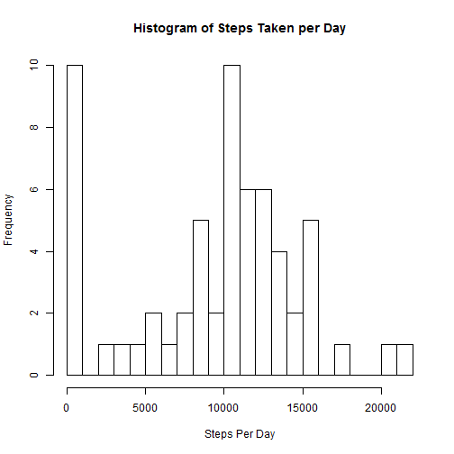
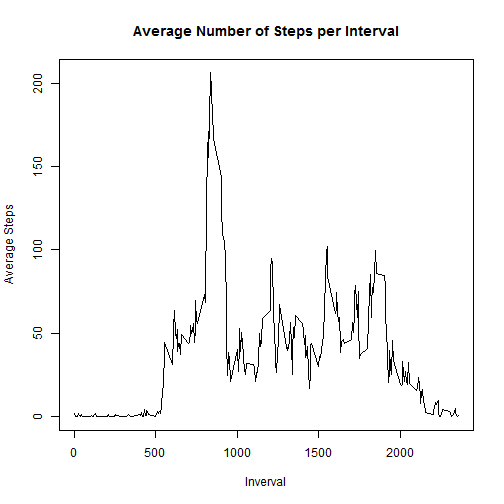
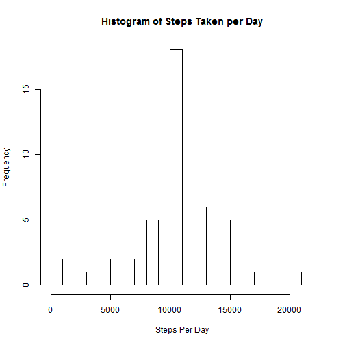
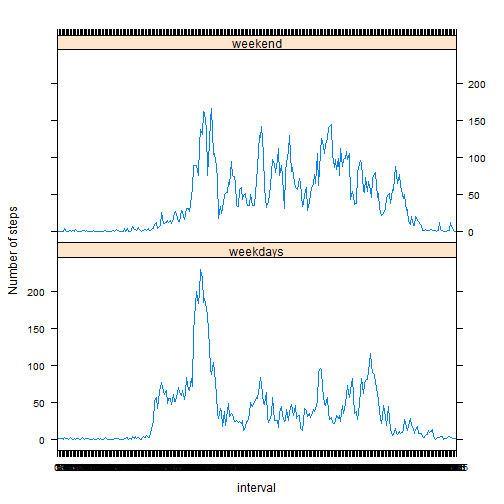

## Loading and preprocessing the data


```r
library(knitr)
library(dplyr)
library(lattice)
```


Unzip the activity.zip file and read the .csv file into a variable called data


```r
setwd("C:/Users/Sam/Documents/Coursera/ReproducibleResearch/Project1/RepData_PeerAssessment1")
unzip("activity.zip")
data<-read.csv("activity.csv",header=TRUE,sep=",")
```

Convert the interval variable into a factor for use in later analysis.  This is the only processing/transforming needed right now.


```r
data$interval <- as.factor(data$interval)
```

## What is mean total number of steps taken per day?

To calculate the total number of steps taken per day, group the data by day using 
the group_by function in dplyr, then use the summary function to calculate the sum 
of steps for each day


```r
dayGroup <- group_by(data,date)
daySteps <- summarize(dayGroup, stepsPerDay = sum(steps, na.rm =TRUE))
```

Make a historgram of the total number of steps per day

```r
hist(daySteps$stepsPerDay, breaks = 20, main = "Histogram of Steps Taken per Day", xlab = "Steps Per Day")
```

 

Calculate and output the mean and median steps per day

```r
meanSteps <- round(mean(daySteps$stepsPerDay),0)
meanSteps
```

```
## [1] 9354
```

```r
medianSteps <- median(daySteps$stepsPerDay)
medianSteps
```

```
## [1] 10395
```

The mean of the total number of steps per day is 9354, and the median is 10395.

## What is the average daily activity pattern?

Group the data by interval using the group_by function in dplyr, then use summary to calculate the 
average number of steps taken for each interval, averaged across all days


```r
intervalGroup <- group_by(data,interval)
intervalSteps <- summarize(intervalGroup, stepsPerInterval = mean(steps, na.rm=TRUE))
```

Make a plot of the interval and average number of steps.  


```r
intervalSteps$interval <- as.numeric(levels(intervalSteps$interval))
plot(intervalSteps$interval, intervalSteps$stepsPerInterval, main = "Average Number of Steps per Interval",xlab="Inverval", ylab="Average Steps",type="l")
```

 

Calculate the interval that contains the maximum number of steps

```r
maxIndex <- match(max(intervalSteps$stepsPerInterval),intervalSteps$stepsPerInterval)
maxInterval <- intervalSteps$interval[maxIndex]
maxInterval
```

```
## [1] 835
```

The interval with the maximum number of steps is 835.

## Imputing missing values

Calculate the total number of missing values in the steps column of the data

```r
totalNA <- length(which(is.na(data$steps)))
totalNA
```

```
## [1] 2304
```
The total number of missing values is 2304

If a value is missing, replace it with the mean value for the associated 5-minute interval (calculated in Question 3, and stored in intervalSteps variable.
Make a new dataset called data2, that has all NA values replaced.


```r
data2 <- data

for(i in 1:length(data$steps)){
  if(is.na(data$steps[i])){
    temp <- data$interval[i]
    index <- match(temp,intervalSteps$interval)
    steps <- intervalSteps$stepsPerInterval[index]
    data2$steps[i] <- steps
  }
}
```

Repeat question 2, but using data2


```r
dayGroup2 <- group_by(data2,date)
daySteps2 <- summarize(dayGroup2, stepsPerDay2 = sum(steps, na.rm =TRUE))
```

Make a historgram of the total number of steps per day

```r
hist(daySteps2$stepsPerDay2, breaks = 20, main = "Histogram of Steps Taken per Day", xlab = "Steps Per Day")
```

 

Calculate and output the mean and median steps per day

```r
meanStepsNA <- round(mean(daySteps2$stepsPerDay2),0)
meanStepsNA
```

```
## [1] 10766
```

```r
medianStepsNA <- round(median(daySteps2$stepsPerDay2),0)
medianStepsNA
```

```
## [1] 10766
```

The mean of the total number of steps per day with NAs inputed is 1.0766 &times; 10<sup>4</sup>, and the median is 1.0766 &times; 10<sup>4</sup>.

Calculate the difference in mean and median steps from the first part of the assignment.


```r
meanDiff <- abs(meanSteps - meanStepsNA)
meanDiff
```

```
## [1] 1412
```

```r
medianDiff <- abs(medianSteps - medianStepsNA)
medianDiff
```

```
## [1] 371
```

The difference in mean steps per day between ingorning NA values, and adding them in is 1412, and the median is 371. The impact of adding missing data is that the mean and median of daily number of steps are now equal. 

## Are there differences in activity patterns between weekdays and weekends?

First, change the date column from a factor into a date

```r
data2$date <- as.Date(data2$date)
```

Add a new factor variable column to the data2 dataframe that indicates if the date is a weekday or weekend.  Use the mutate function from dplyr to do this


```r
data2<- mutate(data2, day = factor((weekdays(date)=="Saturday"| weekdays(date)=="Sunday"), labels = c("weekdays","weekend")))
```

Group the data by interval using the group_by function in dplyr, then use summary to calculate the 
average number of steps taken for each interval, averaged across all days.  This will be used for the plot


```r
intervalGroup3 <- group_by(data2,interval,day)
intervalSteps3 <- summarize(intervalGroup3, stepsPerInterval3 = mean(steps, na.rm=TRUE))
```

Make a pannel plot of the steps per interval for weekends and weekdays

```r
xyplot(stepsPerInterval3~interval | day, data = intervalSteps3, layout=c(1,2),ylab="Number of steps",type="l")
```

 
